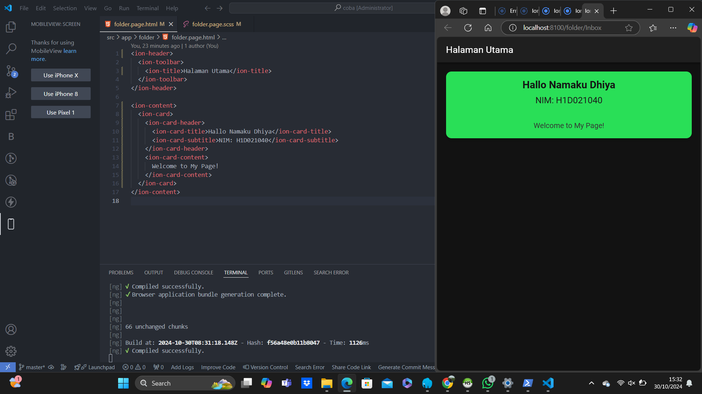

Nama: Dhiya Ulhaq Ayyuasy
NIM: H1D021040

Membuat Komponen di ionic

# NamaProyek

Proyek ini adalah contoh sederhana aplikasi Ionic yang menampilkan komponen `ion-card` dengan Nama dan NIM.

## Hasil Komponen Ionic

## Cara Menambahkan Komponen di Halaman Ionic

1. **Buka Halaman yang Diinginkan:**
   - Arahkan ke folder halaman, misalnya `src/app/folder/folder.page.html` untuk halaman utama.

2. **Pilih dan Tambahkan Komponen:**
   - Tambahkan komponen Ionic sesuai kebutuhan, seperti `<ion-card>`, `<ion-button>`, atau `<ion-list>` di file HTML halaman.

3. **Jalankan dan Lihat Hasilnya:**
   - Jalankan perintah `ionic serve` untuk melihat hasil di browser.

